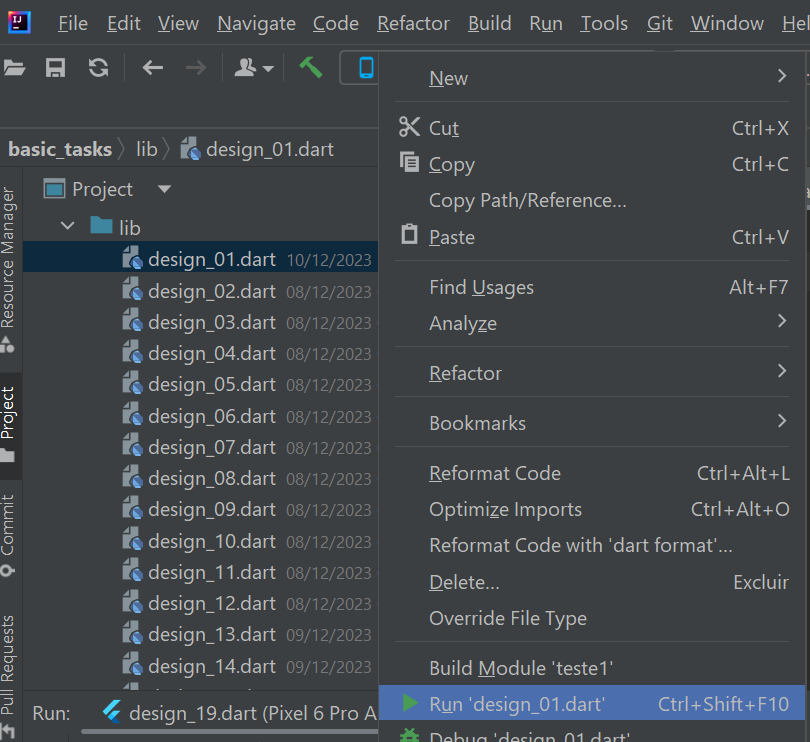
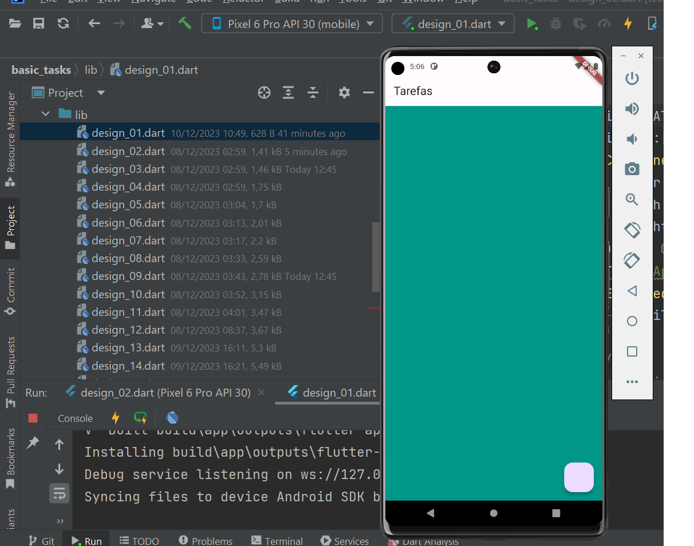
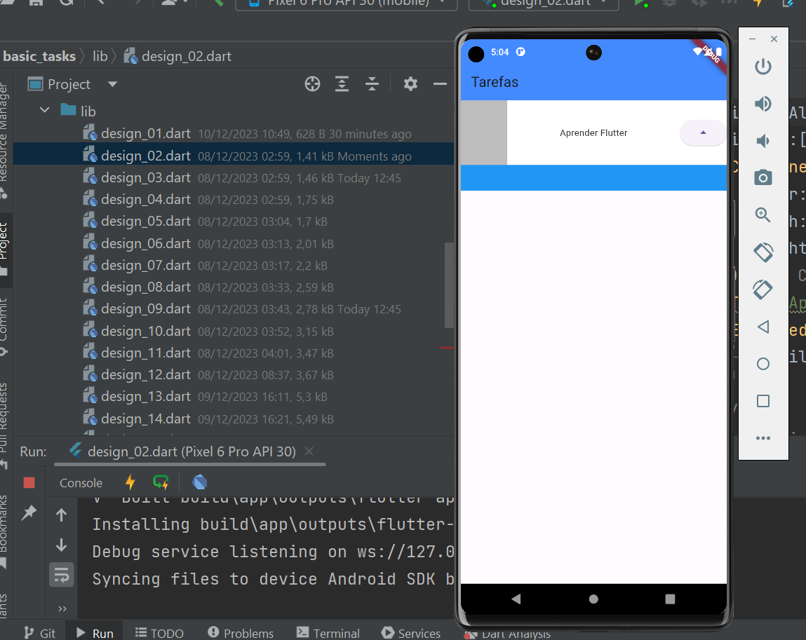
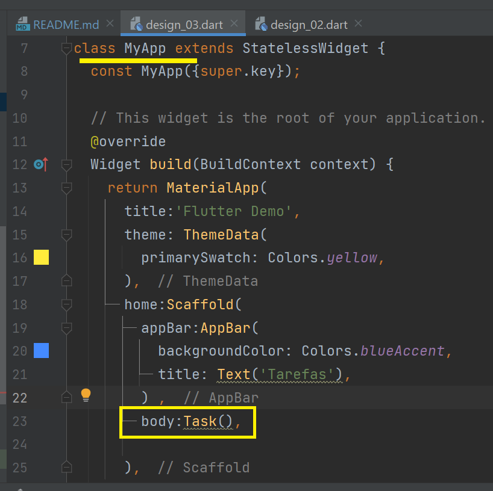
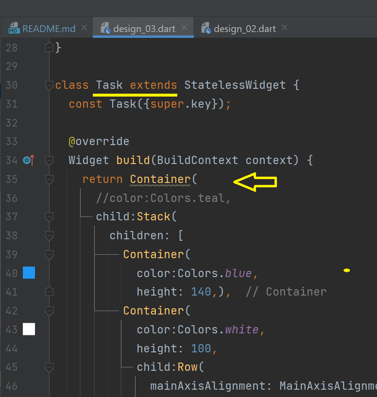
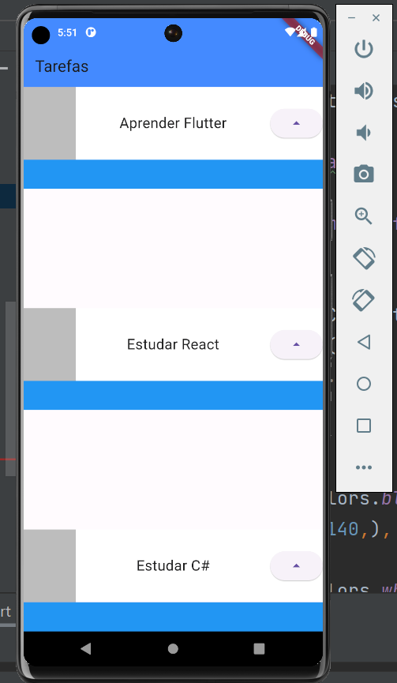
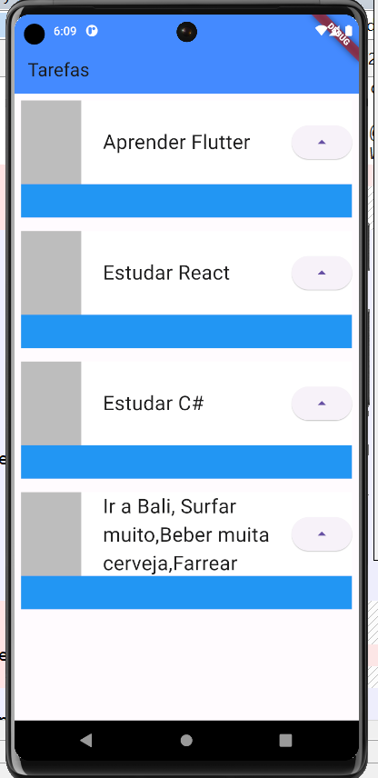
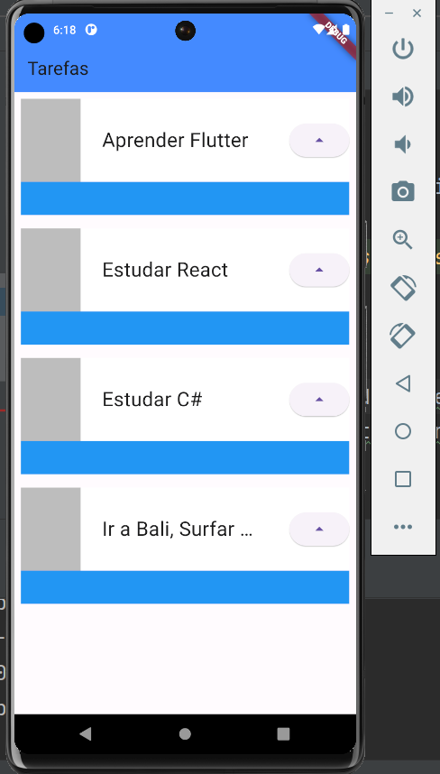

# basic_tasks

## Introdução

  Projeto desenvolvido no curso basico de flutter da ALURA que se trata de um layout de 
uma lista de tarefas onde é possível se ter uma idéia da evolução através de uma 
barra de progresso e assim como a dificuldade através da representação de cinco 
estrelas onde uma representa a mais simples e as cinco representam as mais dificeis.

obs: versão do flutter que adotei foi a mais atual da data.

- Flutter 3.16.2
- Dart 3.2.2 • DevTools 2.28.3
- buildToolsVersion "34.0.0"
- IDE Intellij Idea Community

## Apresentação

 Nesse projeto pretendo apresentar sua evolução de forma particionada 
 por "Módulos Executáveis Independentes" ou se preferir "Componentes 
 de Entrada Autônomos"  .

 
## Módulos Executáveis 

 - design_01.dart

Criação do app 'MyApp baseado em 'Material' com sua classe extendendo 'StatelessWidget' um widget estático . Conhecendo suas propriedades title, theme definidas
Introdução ao uso da classe Scaffold onde retornamos um layout basico contendo um 'AppBar' com sua propriedade title e em seguida um body que será um 'Container' com sua cor de fundo definida para que possa ser notado
No final é adicionado um botão 'floatingActionButton' e feitas suas configuração basica de evento

 - design_02.dart

Inicio da estilização seguindo o layout. Dentro da propriedade body definida como container, inclusão do widget 'Stack' agrupando dois containers empilhados, sendo o primeiro de fundo azul de 140 pixels de profundidade e o segundo
de fundo branco de profundidade de 100 pixels. Contido nesse segundo (child) temos uma linha (row) com um container para um futuro icone, texto e ao lodo um botão (ElevatedButton) todos alinhados com espaços iguais(spaceBetween) .

- design_03.dart

Refatoração de codigo onde o container da propriedade 'body' é substituido pela classe 'Task' quem contem toda funcionalidade existente naquela container

obs: o resultado é o mesmo apresentado em 'design_02.dart'.

-  `fonte1`

 - `fonte2`

- design_04.dart

Na chamada do widget 'Task()' anteriormente unica, é usado um widget do tipo 'Column' e internamente são feitas tres chamadas ao widget 'Task()' onde cada um recebe como paramtro o nome de sua tarefa

obs:foi adaptado a variavel interna em 'Tasks' para que fosse inicializada via construtor 

- `chamadas`

- `layout`

- design_04.dart

- design_05.dart

Alteração de 'body:Column' para 'body:ListView' removendo as propriedades de alinhamento

- design_06.dart

Utilizou um widgets 'Padding' com o intuido de espaçar os componentes do 'Container' mais externo e envolveu o widget 'Text' com um 'Container' com o intuito de limitar o comprimento em 200 pixels para titulos longos

- design_07.dart

Voltando ao titulo da tarefa no widget 'TextStyle' é configurada a propriedade 'overflow: TextOverflow.ellipsis'
afim de truncar textos longos

 

 

