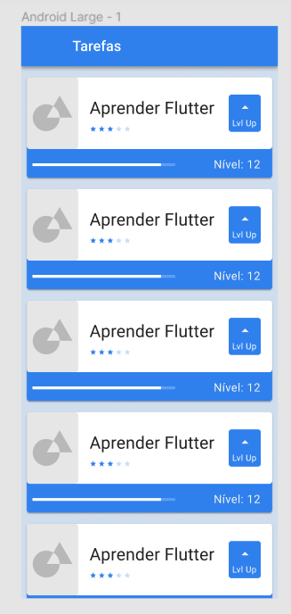

# basic_tasks

## Introdução

  Projeto desenvolvido no curso basico de flutter da ALURA que se trata de um layout de 
uma lista de tarefas onde é possível se ter uma idéia da evolução através de uma 
barra de progresso e assim como a dificuldade através da representação de cinco 
estrelas onde uma representa a mais simples e as cinco representam as mais dificeis.

obs: versão do flutter que adotei foi a mais atual da data.

Flutter 3.16.2
Dart 3.2.2 • DevTools 2.28.3
buildToolsVersion "34.0.0"

## Apresentação

 Nesse projeto pretendo apresentar sua evolução de forma particionada 
 por "Módulos Executáveis Independentes" ou se preferir "Componentes 
 de Entrada Autônomos"  .

This project is a starting point for a Flutter application.

A few resources to get you started if this is your first Flutter project:

- [Lab: Write your first Flutter app](https://docs.flutter.dev/get-started/codelab)
- [Cookbook: Useful Flutter samples](https://docs.flutter.dev/cookbook)

For help getting started with Flutter development, view the
[online documentation](https://docs.flutter.dev/), which offers tutorials,
samples, guidance on mobile development, and a full API reference.
