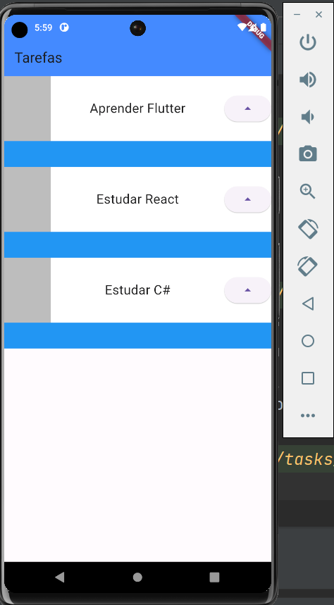

# basic_tasks

## Introdução

  Projeto desenvolvido no curso basico de flutter da ALURA que se trata de um layout de 
uma lista de tarefas onde é possível se ter uma idéia da evolução através de uma 
barra de progresso e assim como a dificuldade através da representação de cinco 
estrelas onde uma representa a mais simples e as cinco representam as mais dificeis.

obs: versão do flutter que adotei foi a mais atual da data.

- Flutter 3.16.2
- Dart 3.2.2 • DevTools 2.28.3
- buildToolsVersion "34.0.0"
- IDE Intellij Idea Community

## Apresentação

 Nesse projeto pretendo apresentar sua evolução de forma particionada 
 por "Módulos Executáveis Independentes" ou se preferir "Componentes 
 de Entrada Autônomos"  .

 
## Módulos Executáveis 

 - design_01.dart

Criação do app 'MyApp baseado em 'Material' com sua classe extendendo 'StatelessWidget' um widget estático . Conhecendo suas propriedades title, theme definidas
Introdução ao uso da classe Scaffold onde retornamos um layout basico contendo um 'AppBar' com sua propriedade title e em seguida um body que será um 'Container' com sua cor de fundo definida para que possa ser notado
No final é adicionado um botão 'floatingActionButton' e feitas suas configuração basica de evento

 - design_02.dart

Inicio da estilização seguindo o layout. Dentro da propriedade body definida como container, inclusão do widget 'Stack' agrupando dois containers empilhados, sendo o primeiro de fundo azul de 140 pixels de profundidade e o segundo
de fundo branco de profundidade de 100 pixels. Contido nesse segundo (child) temos uma linha (row) com um container para um futuro icone, texto e ao lodo um botão (ElevatedButton) todos alinhados com espaços iguais(spaceBetween) .

- design_03.dart

Refatoração de codigo onde o container da propriedade 'body' é substituido pela classe 'Task' quem contem toda funcionalidade existente naquela container

obs: o resultado é o mesmo apresentado em 'design_02.dart'.

-  `fonte1`

 - `fonte2`

- design_04.dart

Na chamada do widget 'Task()' anteriormente unica, é usado um widget do tipo 'Column' e internamente são feitas tres chamadas ao widget 'Task()' onde cada um recebe como paramtro o nome de sua tarefa

obs:foi adaptado a variavel interna em 'Tasks' para que fosse inicializada via construtor 

- `chamadas`

- `layout`

- design_04.dart

- design_05.dart

Alteração de 'body:Column' para 'body:ListView' removendo as propriedades de alinhamento

- design_06.dart

Utilizou um widgets 'Padding' com o intuido de espaçar os componentes do 'Container' mais externo e envolveu o widget 'Text' com um 'Container' com o intuito de limitar o comprimento em 200 pixels para titulos longos

- design_07.dart

Voltando ao titulo da tarefa no widget 'TextStyle' é configurada a propriedade 'overflow: TextOverflow.ellipsis'
afim de truncar textos longos

- design_08.dart

Nesse ponto será adicionadp o evento do contador do nivel por meio do evento 'onPressed' assim como sua apresentação no widget 'Text' estilizado abaixo do widget 'Row'

Outra modificação foi encapasular tudo em um widget 'Column'

- design_09.dart

Devido a necessidade da manutenção de estado pela widget 'Task' esta foi modificada de 'StatelessWidget' estática para 'StatefulWidget' dinâmica e com isso criar a widget '_TaskState' do tipo 'State' para gerenciar este estado

No caso aqui falamos da alteração do contador '_nivel' que precisa ser descrito de forma explicita em dentro setState()

Outra alteração foi do acesso a varivel interna a 'Task' que agora precisa ser referenciada da seguinte form 'widget.nomeTarefa'

- design_10.dart

Inclusão do widget 'LinearProgressIndicator' ao lado de 'Text' usado para indicação do total nivel incrementado assim como o encapsulamento destes via widget 'Row'.
Na propriedade 'value' de 'LinearProgressIndicator' foi adicionada uma formula que converte o valor total incrementado em fracionário devido na soma total o nível máximo ser 1 já que a escala do 'LinearProgressIndicator' varia de 0 a 1

