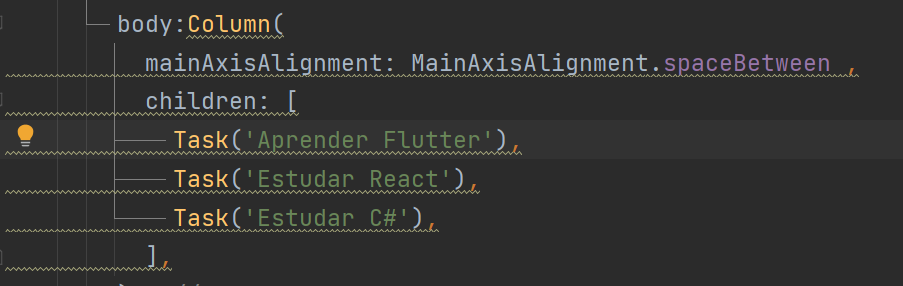

# basic_tasks

## Introdução

  Projeto desenvolvido no curso basico de flutter da ALURA que se trata de um layout de 
uma lista de tarefas onde é possível se ter uma idéia da evolução através de uma 
barra de progresso e assim como a dificuldade através da representação de cinco 
estrelas onde uma representa a mais simples e as cinco representam as mais dificeis.

obs: versão do flutter que adotei foi a mais atual da data.

- Flutter 3.16.2
- Dart 3.2.2 • DevTools 2.28.3
- buildToolsVersion "34.0.0"
- IDE Intellij Idea Community

## Apresentação

 Nesse projeto pretendo apresentar a evolução do layout a ser alcançado 
 de forma particionada por "Módulos Executáveis Independentes" ou se 
 preferir "Componentes de Entrada Autônomos"  .

 
## Módulos Executáveis 

 - design_01.dart

Criação do app 'MyApp baseado em 'Material' com sua classe extendendo 'StatelessWidget' um widget estático . Conhecendo suas propriedades title, theme definidas
Introdução ao uso da classe Scaffold onde retornamos um layout basico contendo um 'AppBar' com sua propriedade title e em seguida um body que será um 'Container' com sua cor de fundo definida para que possa ser notado
No final é adicionado um botão 'floatingActionButton' e feitas suas configuração basica de evento

 - design_02.dart

Inicio da estilização seguindo o layout. Dentro da propriedade body definida como container, inclusão do widget 'Stack' agrupando dois containers empilhados, sendo o primeiro de fundo azul de 140 pixels de profundidade e o segundo
de fundo branco de profundidade de 100 pixels. Contido nesse segundo (child) temos uma linha (row) com um container para um futuro icone, texto e ao lodo um botão (ElevatedButton) todos alinhados com espaços iguais(spaceBetween) .

- design_03.dart

Refatoração de codigo onde o container da propriedade 'body' é substituido pela classe 'Task' quem contem toda funcionalidade existente naquela container

obs: o resultado é o mesmo apresentado em 'design_02.dart'.

-  `fonte1`
 

 - `fonte2`

 

- design_04.dart

Na chamada do widget 'Task()' anteriormente unica, é usado um widget do tipo 'Column' e internamente são feitas tres chamadas ao widget 'Task()' onde cada um recebe como paramtro o nome de sua tarefa

obs:foi adaptado a variavel interna em 'Tasks' para que fosse inicializada via construtor 

- `chamadas`

- `layout`

- design_04.dart

 
- design_05.dart

Alteração de 'body:Column' para 'body:ListView' removendo as propriedades de alinhamento

 
- design_06.dart

Utilizou um widgets 'Padding' com o intuido de espaçar os componentes do 'Container' mais externo e envolveu o widget 'Text' com um 'Container' com o intuito de limitar o comprimento em 200 pixels para titulos longos

 
- design_07.dart

Voltando ao titulo da tarefa no widget 'TextStyle' é configurada a propriedade 'overflow: TextOverflow.ellipsis'
afim de truncar textos longos

 - design_08.dart

Nesse ponto será adicionadp o evento do contador do nivel por meio do evento 'onPressed' assim como sua apresentação no widget 'Text' estilizado abaixo do widget 'Row'

Outra modificação foi encapasular tudo em um widget 'Column'

 

- design_09.dart

Devido a necessidade da manutenção de estado pela widget 'Task' esta foi modificada de 'StatelessWidget' estática para 'StatefulWidget' dinâmica e com isso criar a widget '_TaskState' do tipo 'State' para gerenciar este estado

No caso aqui falamos da alteração do contador '_nivel' que precisa ser descrito de forma explicita em dentro setState()

Outra alteração foi do acesso a varivel interna a 'Task' que agora precisa ser referenciada da seguinte form 'widget.nomeTarefa'

 
- design_10.dart

Inclusão do widget 'LinearProgressIndicator' ao lado de 'Text' usado para indicação do total nivel incrementado assim como o encapsulamento destes via widget 'Row'.
Na propriedade 'value' de 'LinearProgressIndicator' foi adicionada uma formula que converte o valor total incrementado em fracionário devido na soma total o nível máximo ser 1 já que a escala do 'LinearProgressIndicator' varia de 0 a 1

 
- design_11.dart

Espaçamento do widgets 'Row' contendo 'LinearProgressIndicator' e a widget 'Text' onde ambas são encapsuladas em 'Padding' sendo um para cada 

 
- design_12.dart

 Aqui o código modificado no título do AppBar foi envolvido com um Padding widget e um estilo foi adicionado ao texto. O Padding tem um valor de EdgeInsets.only(left: 32), o que desloca o título para a direita. Além disso, o estilo do texto foi definido com TextStyle(color: Colors.white), o que define a cor do texto como branco.
 

- design_13.dart

1 - AppBar Alterações:

Remoção do Padding no Título: No código original, o título 'Tarefas' estava dentro de um widget Padding. No código  
Adição de um Leading Container: Um Container vazio foi adicionado como o widget leading na AppBar. Isso é mencionado como um espaço ocupador, possivelmente para alinhamento visual.

2 - Alterações no Widget Task:

- Alteração no Layout do Botão:
 - Padding Adicionado: Um Padding foi adicionado em torno do botão.
 - Alteração no Tamanho do Botão: O botão agora tem uma largura de 80 e uma altura de 60.
 - Estilo Personalizado: O botão agora usa ElevatedButton.styleFrom para personalizar a cor de fundo, a cor do texto e a forma do botão.

 - Adição de um FittedBox com Coluna: Dentro do botão, um FittedBox contendo uma Column foi adicionado. Esta coluna contém um ícone e um texto ('Up'), com um SizedBox entre eles para espaçamento.
 - Alteração no Padding da Barra de Progresso e Texto de Nível: O Padding para a barra de progresso e o texto de nível foi ajustado, especialmente com a adição de EdgeInsets.only(left: 8) para a barra de progresso e EdgeInsets.all(12.0) para o texto de nível.

 
- design_14.dart

As seguintes mudanças introduz um elemento visual dinâmico (uma imagem GIF) no layout de cada tarefa, provavelmente para melhorar a estética ou para fornecer um contexto visual adicional.

1- Adição de uma Imagem no Widget Task:

- Dentro da classe _TaskState, no método build, dentro do Row que compõe cada tarefa (Task), foi adicionado um widget Image.network no primeiro Container (aquele com color: Colors.black26 e dimensões de 72x100).

- A imagem é carregada de uma URL ('https://docs.flutter.dev/assets/images/dash/dash-fainting.gif') e é configurada para se ajustar ao espaço disponível usando fit: BoxFit.cover.

 
- design_15.dart

As seguintes mudanças permitem que cada tarefa tenha uma imagem associada, e essas imagens são carregadas localmente em vez de serem baixadas da internet.

1 - Declaração de Constantes para Imagens:
No início do código modificado, foram adicionadas quatro constantes para armazenar os caminhos das imagens:

- imageFlutter
- imageReact
- imageCsharp
- imageBali

2 - Passagem de Parâmetro Adicional na Classe Task:
Na classe Task, foi adicionado um segundo parâmetro chamado urlFoto. Isso modifica o construtor da classe para aceitar não apenas o nome da tarefa (nomeTarefa), mas também o caminho da imagem (urlFoto).

3 - Uso das Constantes de Imagem na Criação de Objetos Task:
Na criação dos objetos Task dentro do método build da classe MyApp, agora são passados dois argumentos: o nome da tarefa e o caminho da imagem correspondente (usando as constantes declaradas anteriormente).

4- Alteração na Exibição da Imagem na Classe _TaskState:
Dentro do método build da classe _TaskState, a linha que anteriormente usava Image.network para carregar uma imagem da internet foi substituída por uma condição. Agora, se widget.urlFoto não estiver vazia, a imagem é carregada usando Image.asset com o caminho fornecido em widget.urlFoto. Se widget.urlFoto estiver vazia, um Container vazio é exibido no lugar.

 

- design_16.dart

As seguintes mudanças introduzem uma visualização de classificação por estrelas para cada tarefa, permitindo uma representação visual da avaliação ou importância de cada tarefa na lista.

1- Adição de Ícones de Estrelas na Classe _TaskState:
Dentro do método build da classe _TaskState, após a definição do Container que contém o texto da tarefa (widget.nomeTarefa), foi adicionada uma nova Column que contém duas partes:

- A primeira parte é a mesma que no código original, exibindo o nome da tarefa.
- A segunda parte é uma nova Row que contém ícones de estrelas para representar uma classificação. Há cinco ícones Icon com Icons.star, onde os três primeiros têm a cor completa (Colors.blue) e os dois últimos têm uma cor mais clara (Colors.blue[100]). Isso sugere uma classificação de 3 em 5 estrelas.

2 -Alteração na Estrutura de Widgets:
A estrutura de widgets foi ligeiramente modificada para acomodar os ícones de estrelas. O Text widget que mostra o nome da tarefa e a Row dos ícones de estrelas estão agora dentro de uma Column, que está alinhada ao início (crossAxisAlignment: CrossAxisAlignment.start) e ao centro verticalmente (mainAxisAlignment: MainAxisAlignment.center).

- design_17.dart

As seguintes alterações tornam o código mais flexível e dinâmico, permitindo que cada tarefa tenha um nível de dificuldade associado e que a interface do usuário reflita essa dificuldade de forma mais interativa.

1- Adição de um Novo Parâmetro na Classe Task:

  - Um novo parâmetro dificuldadeTarefa do tipo int foi adicionado ao construtor da classe Task. Isso significa que agora cada tarefa pode ter um nível de dificuldade associado a ela.

2 - Alteração na Inicialização das Tarefas:

  - Ao criar as instâncias de Task no corpo do widget ListView, agora são passados três argumentos em vez de dois. O terceiro argumento é o nível de dificuldade da tarefa (por exemplo, Task('Aprender Flutter', imageFlutter, 3)).

3 - Remoção do Código de Estrelas Estáticas:

   - No código original, havia um bloco de código que criava uma linha de ícones de estrelas de forma estática. Este bloco foi removido no código modificado.

4 - Adição de um Método para Construir Estrelas Dinamicamente:

Foi adicionado um novo método chamado buildStars, que aceita um inteiro starCount e retorna uma lista de widgets Icon. Este método constrói dinamicamente uma linha de ícones de estrelas, onde o número de estrelas preenchidas é determinado pelo valor de starCount.
Uso do Método buildStars na Construção da UI:

Dentro do método build da classe _TaskState, o método buildStars é utilizado para gerar a linha de estrelas com base no valor de dificuldadeTarefa de cada tarefa.
Alteração no Widget LinearProgressIndicator:

O valor do LinearProgressIndicator foi modificado para ser calculado com base no nível da tarefa e sua dificuldade. Se a dificuldade da tarefa for maior que zero, o progresso é calculado como _nivel / (widget.dificuldadeTarefa * 10), caso contrário, o valor é definido como 1.

 

 

- design_18.dart

As seguintes mudanças visam melhorar a estética da interface do usuário, dando um aspecto mais polido e moderno aos elementos visuais, especialmente com o uso de bordas arredondadas.

1 - Adição de Decoração de Container com BorderRadius: No código modificado, foram adicionadas decorações aos containers para dar-lhes bordas arredondadas (BorderRadius). Isso é feito usando o BoxDecoration com borderRadius: BorderRadius.circular(4).

Essa mudança foi aplicada em três lugares:

    - No container que tem a cor azul (que forma o fundo de cada item da lista).
    - No container que tem a cor branca (que contém a imagem, o texto da tarefa e os botões).
    - No container que tem a cor Colors.black26 (que contém a imagem).

2 - Uso de ClipRRect para Imagens: No container que contém a imagem (widget.urlFoto), foi adicionado um ClipRRect com borderRadius: BorderRadius.circular(4). Isso é usado para cortar a imagem com bordas arredondadas, mantendo a consistência com o estilo geral dos containers.

- design_19.dart

As seguintes mudanças introduzem uma funcionalidade de animação de opacidade para o ListView contendo as tarefas, permitindo que ele desapareça ou apareça suavemente quando o botão flutuante é pressionado.

1 - Alteração da Classe MyApp para StatefulWidget:

- No código original, MyApp é um StatelessWidget. No código modificado, MyApp foi transformado em um StatefulWidget. Isso é feito para permitir que o widget gerencie seu próprio estado.

2- Adição de Variável de Estado _opacidade:

- Uma nova variável de estado _opacidade foi adicionada na classe _MyAppState. Esta variável é um bool que controla a opacidade de um widget.

3 - Uso de AnimatedOpacity:

- No corpo (body) do Scaffold dentro do build da classe _MyAppState, o ListView foi envolvido com um AnimatedOpacity. Isso permite animar a opacidade do ListView. A opacidade é controlada pela variável _opacidade e a duração da animação é definida como 1000 milissegundos.

4 - Adição de um FloatingActionButton:

- Um FloatingActionButton foi adicionado ao Scaffold. Este botão, ao ser pressionado, alterna o valor da variável _opacidade, fazendo com que a opacidade do ListView mude entre visível (1.0) e invisível (0.0).

5 - Alteração no Método main:

- No método main, a chamada para runApp foi alterada de runApp(const MyApp()) para runApp(MyApp()). Isso é necessário porque MyApp agora é um StatefulWidget e não mais um StatelessWidget.

antes do click

após o click

